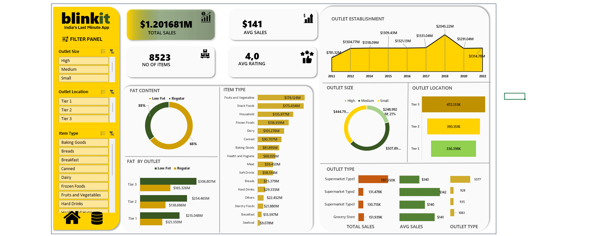

# 📊 Blinkit Sales Dashboard (Excel Project)

 

## 📌 Project Overview
This is my **second project in Sales Analysis**, built using **Advanced Microsoft Excel** as part of my **Data Science learning journey**.  
The goal was to fulfill a real-world business requirement by creating an **interactive, dynamic dashboard** for Blinkit, an Indian online grocery platform.

---

## 🚀 Features Implemented

### ✅ Business Requirements Fulfilled:
- **Sales by Fat Content** (Donut Chart)
- **Sales by Item Type** (Bar Chart)
- **Fat Content by Outlet** (Stacked Column Chart)
- **Sales by Outlet Establishment** (Line Chart)
- **Sales by Outlet Size** (Pie Chart)
- **Sales by Outlet Location** (Funnel Map)
- **All KPIs by Outlet Type** (Matrix View)

### 📊 KPI Metrics Tracked:
- 💰 **Total Sales**  
- 📈 **Average Sales**  
- 📦 **Number of Items Sold**  
- ⭐ **Average Rating**

### 🧠 Dashboard Capabilities:
- Fully dynamic with **slicers** for:
  - Outlet Size  
  - Outlet Location  
  - Item Type  
- Interactive visualizations update automatically based on slicer selections
- Clean layout with professional chart designs and conditional formatting

---

## 🛠 Tools & Techniques Used:
- Microsoft Excel (Advanced)
  - Pivot Tables  
  - Pivot Charts  
  - Slicers  
  - Data Modeling  
  - Dynamic Charting  
  - Conditional Formatting

---

## 🎯 Business Insights Unlocked:
- Tier 3 outlets have the highest sales volume  
- Regular fat content products drive more sales  
- Certain item types (e.g. Fruits & Vegetables, Snack Foods) dominate total revenue  
- Supermarket Type 1 outlets outperform in both sales and item variety  

---

## 📎 How to Use
1. Open the `Dashboard` sheet in Excel.
2. Use the slicers on the left panel to filter by outlet size, location, or item type.
3. All charts and KPIs will update automatically based on your selection.

---

## 📁 Files Included
- `BlinkIT Grocery Data Excel.xlsx` – Main file with dashboard
- `Blinkit.png` – Dashboard preview image

---

## 📚 Author
**Manish Singh**  
Aspiring Data Scientist | Learning by Doing 🚀  
🔗 [Connect with me on LinkedIn](https://www.linkedin.com/in/manishsingh2217) 

---

## 📌 Future Plans
- Replicate this dashboard using **Power BI**  
- Build a Python-based version with **Plotly** and **Pandas**  
- Automate insights with **SQL queries** for backend reporting

---

## 🔖 Tags
`#ExcelDashboard` `#DataScience` `#SalesAnalysis` `#BlinkitProject` `#KPI` `#AdvancedExcel` `#DynamicDashboard` `#GitHubPortfolio` `#ManishLearnsData`
